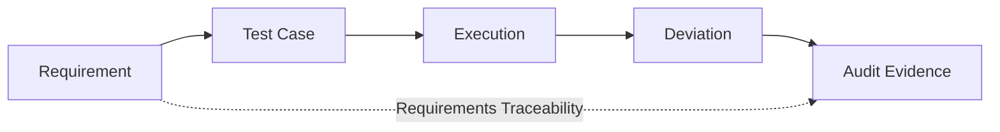
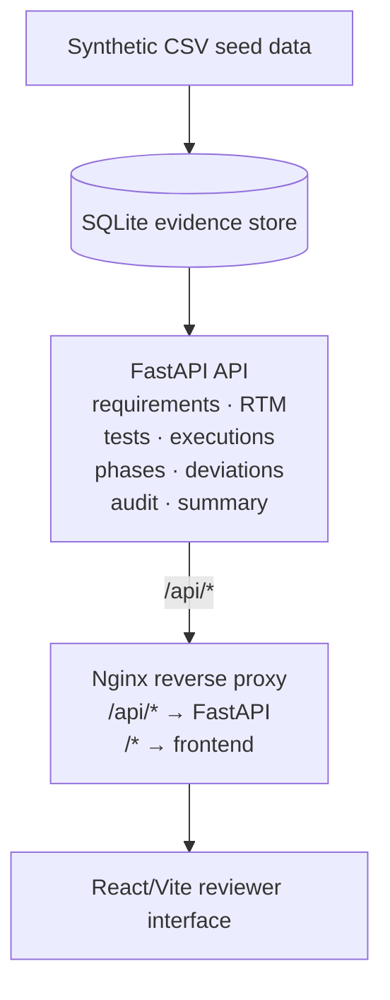

# CSV Evidence Tracker

<div align="center">


**GxP · CSV · ALCOA+ · Requirements Traceability · IQ/OQ/PQ**

*A portfolio-safe full-stack prototype for traceable validation evidence.*

[Quick Start](#quick-start) · [Release Evidence](#verified-v100-evidence) · [Architecture](docs/architecture.md) · [Validation Boundary](docs/VALIDATION_BOUNDARY.md)

</div>

---

> **Data boundary:** All bundled records are fictional/synthetic. This repository contains no proprietary, employer, patient, personal, or regulated production data. It is **not validated software** and must not be used to make regulated quality decisions.

## Why this project exists

Computer System Validation work is not just about storing requirements or test results. The evidence needs to remain **traceable, reviewable, attributable, and reproducible**.

CSV Evidence Tracker demonstrates that workflow as an executable system:



It combines a reviewer-facing UI with an API, structured SQLite persistence, explainable deviation risk scoring, CI checks, and a containerized deployment path.

## What it demonstrates

| Area | Evidence in the repository |
|---|---|
| Requirements traceability | RTM linking requirements to test cases and latest executions |
| IQ / OQ / PQ workflow | Phase-aware test evidence and execution records |
| Deviation management | Create, review, resolve, CAPA reference, and explainable risk classification |
| Audit concepts | Actor-aware, append-oriented audit records for review |
| API engineering | FastAPI routers, Pydantic schemas, SQLite persistence, health/summary endpoints |
| Reviewer experience | React/Vite dashboard, RTM, test queue, deviations, phases, and audit views |
| Reproducible builds | Committed npm lockfile, `npm ci`, GitHub Actions coverage gate |
| Runtime verification | Docker Compose build/start/health + reverse-proxy smoke tests in CI |
| Governance | Explicit portfolio-safety and validation-boundary documentation |

## Verified v1.0.0 evidence

The release candidate is validated by GitHub Actions rather than README-only claims:

- **27 / 27 backend tests passing**
- **79.37% backend statement coverage** with a **70% minimum gate**
- frontend dependencies installed reproducibly with **`npm ci`**
- React/Vite production build passing
- Docker Compose configuration validated and service images built from scratch
- API, frontend, and reverse proxy reach healthy state
- reverse-proxy smoke checks pass for:
  - `/`
  - `/health`
  - `/api/summary`
  - `/api/phases`
  - `/api/test-cases`
  - `/api/deviations`
  - `/api/audit-log`
  - `/api/rtm`

The synthetic seed dataset exercised by the Compose smoke run contains **12 requirements, 21 test cases, and 18 recorded executions**. Those are demonstration records, not production validation evidence.

## Architecture



See [architecture](docs/architecture.md), [validation approach](docs/validation-approach.md), and [regulatory references](docs/REGULATORY_REFERENCES.md).

## Quick Start

### Docker Compose — recommended

Prerequisites: Docker with Compose support.

```bash
git clone https://github.com/alianisreyesr/csv-evidence-tracker.git
cd csv-evidence-tracker
docker compose up --build
```

Then open:

- application: `http://localhost/`
- health: `http://localhost/health`
- API docs: `http://localhost/docs`

Stop the stack with:

```bash
docker compose down
```

This exact Compose path is exercised by CI with build, health, SPA, and API smoke checks.

### Local development

```bash
# Backend
python -m venv .venv
source .venv/bin/activate   # Windows: .venv\Scripts\activate
python -m pip install -r requirements.txt
uvicorn app.main:app --reload
```

In another terminal:

```bash
cd frontend
npm ci
npm run dev
```

The local Vite workflow is intended for development; the Docker path mirrors the integrated reverse-proxy setup.

## Core API surface

| Endpoint | Purpose |
|---|---|
| `GET /health` | Runtime health + data-boundary message |
| `GET /summary` | Validation evidence summary |
| `GET /phases` | IQ/OQ/PQ phase state |
| `GET /requirements` | Requirements evidence |
| `GET /test-cases` | Test cases + requirement context |
| `GET/POST /executions` | Test execution evidence |
| `GET/POST /deviations` | Deviation workflow + explainable risk |
| `POST /deviations/{id}/resolve` | Controlled resolution action |
| `GET /audit-log` | Reviewable audit trail |
| `GET /rtm` | Requirements traceability matrix |

Mutating evidence endpoints use an `X-Actor` header to demonstrate attributable actions. This is an auditability concept, **not production authentication or electronic-signature validation**.

## Explainable deviation risk

Deviation risk is intentionally rule-based rather than opaque. The API returns:

- `risk_score`
- `risk_classification`
- `contributing_reasons`

Critical severity is classified as High, while recurrence, overdue state, severity, and ownership contribute transparent score reasons. This makes reviewer decisions inspectable in a portfolio context.

## Repository structure

```text
csv-evidence-tracker/
├── app/                  # FastAPI application and scoring
│   └── routers/          # requirements, tests, deviations, audit, RTM
├── frontend/             # React/Vite reviewer UI + package-lock.json
├── data/                 # synthetic CSV seed records
├── sql/                  # SQLite schema
├── docs/                 # architecture, safety, validation boundary
├── tests/                # backend automated tests
├── nginx/                # integrated reverse-proxy configuration
├── .github/workflows/    # backend/frontend/Compose CI
├── docker-compose.yml
├── Dockerfile
└── CHANGELOG.md
```

## Validation and regulatory boundary

This project demonstrates engineering and evidence-management concepts relevant to regulated environments, but it does **not** claim to be a validated GxP system.

A production implementation would require substantially more, including approved procedures, controlled infrastructure, formal validation deliverables, identity/access controls, electronic-signature controls where applicable, backup/recovery qualification, security controls, change control, operational monitoring, and organization-specific quality governance.

Reference documents:

- [Portfolio Safety](docs/PORTFOLIO_SAFETY.md)
- [Validation Boundary](docs/VALIDATION_BOUNDARY.md)
- [Regulatory References](docs/REGULATORY_REFERENCES.md)
- [Review Checklist](docs/REVIEW_CHECKLIST.md)

## Engineering notes

v1.0.0 prioritizes functional traceability and reproducible runtime evidence. Identified follow-on improvements — broader route-level tests, frontend code splitting, dependency modernization — are tracked openly as engineering opportunities, consistent with a continuous-improvement mindset in regulated environments.

---

## Regulated Portfolio Ecosystem

| Project | Domain Focus | Status |
|---|---|---|
| **[Quality Deviation Risk Monitor](https://github.com/alianisreyesr/quality-deviation-risk-monitor)** | Deviation prioritization & explainable risk scoring | ✅ Active · 57 tests |
| **[Data Integrity Case File](https://github.com/alianisreyesr/data-integrity-case-file)** | ALCOA+ investigation, CAPA readiness, local AI triage | ✅ Active |
| **[GxP Change Control](https://github.com/alianisreyesr/gxp-change-control)** | Controlled change lifecycle & approvals | ✅ Active · 68 tests |
| **[CSA Assurance Planner](https://github.com/alianisreyesr/csa-assurance-planner)** | Risk-based software assurance planning, FDA CSA alignment | ✅ Active |
| **[GxP Batch Data Pipeline](https://github.com/alianisreyesr/gxp-batch-data-pipeline)** | Batch manufacturing pipeline — DuckDB · dbt · quality gates | ✅ Active |

---

<div align="center">

**Built by [Alianis Reyes-Reyes](https://www.linkedin.com/in/alianis-reyes-reyes/)**

Information Systems @ UPRM · Eli Lilly Tech@Lilly Alumni

*Every design decision asks: would this evidence still be trustworthy under inspection?*

</div>
