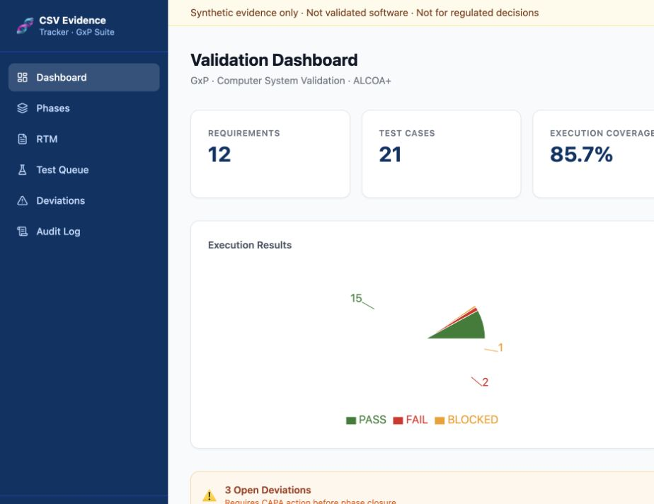
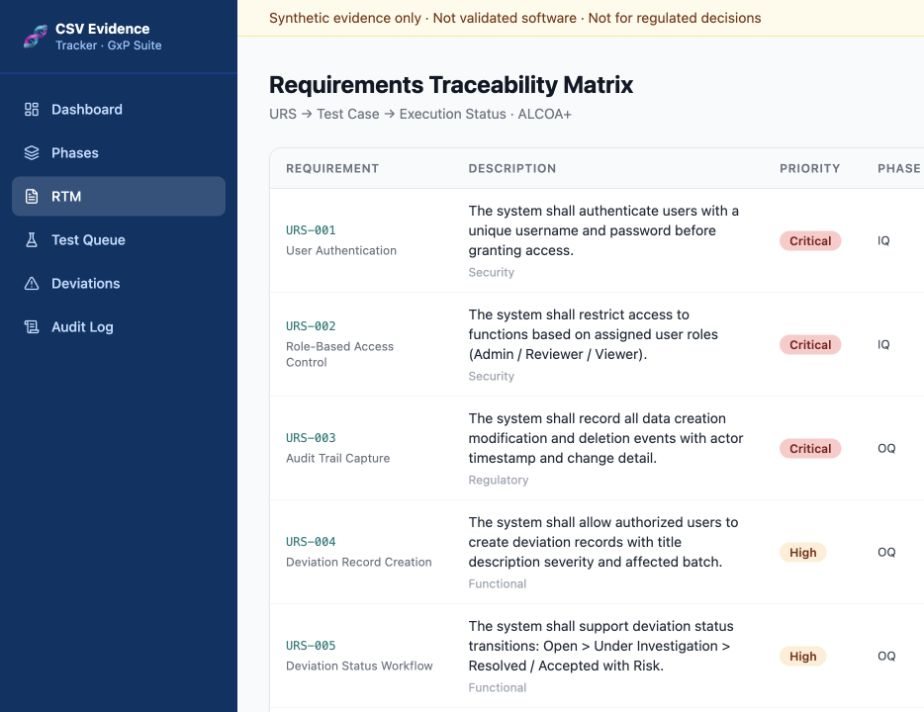
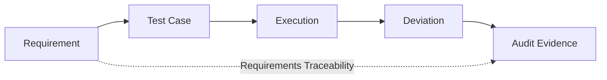
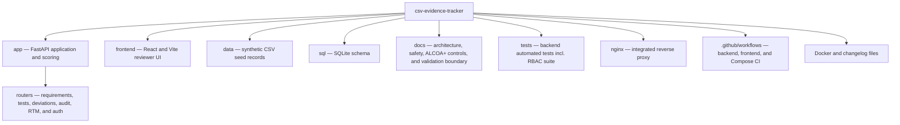

# CSV Evidence Tracker

<div align="center">

[](https://github.com/alianisreyesr/csv-evidence-tracker/actions/workflows/ci.yml)
[](https://github.com/alianisreyesr/csv-evidence-tracker/actions/workflows/codeql.yml)


**GxP · CSV · ALCOA+ · RBAC · Requirements Traceability · IQ/OQ/PQ**

*A portfolio-safe full-stack prototype for traceable validation evidence.*

[Screenshots](#portfolio-preview) · [Quick Start](#quick-start) · [Case study](docs/CASE_STUDY.md) · [Demo guide](docs/PORTFOLIO_DEMO.md) · [Architecture](docs/architecture.md) · [Validation Boundary](docs/VALIDATION_BOUNDARY.md) · [Data Integrity Controls](docs/data-integrity-controls.md)

</div>

---

> **Data boundary:** All bundled records are fictional/synthetic. This repository contains no proprietary, employer, patient, personal, or regulated production data. It is **not validated software** and must not be used to make regulated quality decisions.

## Portfolio preview

| Validation dashboard | Requirements traceability matrix |
|---|---|
|  |  |

See the [case study](docs/CASE_STUDY.md) for the business problem, users, decisions, evidence, and production boundary.

## Why this project exists

Computer System Validation work is not just about storing requirements or test results. The evidence needs to remain **traceable, reviewable, attributable, and reproducible**.

CSV Evidence Tracker demonstrates that workflow as an executable system:



It combines a reviewer-facing UI with an API, structured SQLite persistence, explainable deviation risk scoring, role-based access control, CI checks, and a containerized deployment path.

## What it demonstrates

| Area | Evidence in the repository |
|---|---|
| Requirements traceability | RTM linking requirements to test cases and latest executions |
| IQ / OQ / PQ workflow | Phase-aware test evidence and execution records |
| Deviation management | Create, review, resolve, CAPA reference, and explainable risk classification |
| **Role-based access control** | **JWT authentication with Analyst / QA Reviewer / Admin roles enforced at the router level (21 CFR Part 11 §11.10(d))** |
| **ALCOA+ data integrity** | **Each principle mapped to its implementation control — see [data-integrity-controls.md](docs/data-integrity-controls.md)** |
| Audit concepts | Actor-aware, append-oriented audit records; read-only for Analyst, delete restricted to Admin |
| API engineering | FastAPI routers, Pydantic schemas, SQLite persistence, health/summary endpoints |
| Reviewer experience | React/Vite dashboard, RTM, test queue, deviations, phases, and audit views |
| Reproducible builds | Committed npm lockfile, `npm ci`, GitHub Actions coverage gate |
| Runtime verification | Docker Compose build/start/health + reverse-proxy smoke tests in CI |
| Governance | Explicit portfolio-safety and validation-boundary documentation |

## Authentication & Role-Based Access Control

v1.1.0 introduces JWT-based authentication and three roles aligned with a typical CSV review workflow:

| Role | Permissions |
|---|---|
| **Analyst** | Submit executions · Read deviations · Read audit log |
| **QA Reviewer** | All Analyst permissions + approve / resolve deviations |
| **Admin** | All QA Reviewer permissions + delete audit log entries |

Role enforcement is applied at the FastAPI dependency layer via `require_role()` in `app/dependencies.py`, which is invoked inside each router using `Depends()`. No endpoint bypass is possible without a valid JWT signed by the server secret.

```bash
# Obtain a token (synthetic portfolio credentials)
curl -X POST http://localhost/api/auth/login \
  -d "username=qa_reviewer01&password=QAReview01!"

# Use the token on a protected endpoint
curl -H "Authorization: Bearer <token>" \
  http://localhost/api/deviations
```

All RBAC controls are covered by the automated test suite in [`tests/test_auth_roles.py`](tests/test_auth_roles.py) (13 test cases, including explicit 401 and 403 negative tests).

## Verified evidence

The release candidate is validated by GitHub Actions rather than README-only claims:

- **Backend tests passing** with a **70% minimum coverage gate**
- **13 RBAC-specific tests** covering unauthenticated, forbidden, and authorised scenarios
- Frontend dependencies installed reproducibly with **`npm ci`**
- React/Vite production build passing
- Docker Compose configuration validated and service images built from scratch
- API, frontend, and reverse proxy reach healthy state
- Reverse-proxy smoke checks pass for all public and authenticated routes

The synthetic seed dataset contains **12 requirements, 21 test cases, and 18 recorded executions**. Those are demonstration records, not production validation evidence.

## Architecture

```mermaid
flowchart TD
    SEED[Synthetic CSV seed data]
    DB[(SQLite evidence store)]
    AUTH["JWT Auth layer\nAnalyst · QA Reviewer · Admin"]
    API["FastAPI API\nrequirements · RTM\ntests · executions\nphases · deviations\naudit · summary"]
    NGINX["Nginx reverse proxy\n/api/* → FastAPI\n/* → frontend"]
    UI[React/Vite reviewer interface]

    SEED --> DB
    DB --> API
    AUTH -->|require_role()| API
    API -->|/api/*| NGINX
    NGINX --> UI
```

See [architecture](docs/architecture.md), [validation approach](docs/validation-approach.md), [regulatory references](docs/REGULATORY_REFERENCES.md), and [data integrity controls](docs/data-integrity-controls.md).

## Quick Start

### Docker Compose — recommended

Prerequisites: Docker with Compose support.

```bash
git clone https://github.com/alianisreyesr/csv-evidence-tracker.git
cd csv-evidence-tracker
docker compose up --build
```

Then open:

- Application: `http://localhost/`
- Health check: `http://localhost/health`
- API docs (Swagger UI): `http://localhost/docs`
- Auth login: `POST http://localhost/api/auth/login`

Stop the stack with:

```bash
docker compose down
```

### Local development

```bash
# Backend
python -m venv .venv
source .venv/bin/activate   # Windows: .venv\Scripts\activate
python -m pip install -r requirements.txt
uvicorn app.main:app --reload
```

In another terminal:

```bash
cd frontend
npm ci
npm run dev
```

## Core API surface

| Endpoint | Purpose | Min. Role |
|---|---|---|
| `POST /auth/login` | Obtain Bearer JWT | — |
| `GET /auth/me` | Current user identity | Any authenticated |
| `GET /health` | Runtime health + data-boundary message | — |
| `GET /summary` | Validation evidence summary | — |
| `GET /phases` | IQ/OQ/PQ phase state | Any authenticated |
| `GET /requirements` | Requirements evidence | Any authenticated |
| `GET /test-cases` | Test cases + requirement context | Any authenticated |
| `GET/POST /executions` | Test execution evidence | Any authenticated |
| `GET/POST /deviations` | Deviation workflow + explainable risk | Any authenticated |
| `PATCH /deviations/{id}/resolve` | Controlled resolution action | **QA Reviewer / Admin** |
| `GET /audit-log` | Reviewable audit trail | Any authenticated |
| `DELETE /audit-log/{id}` | Remove audit entry | **Admin only** |
| `GET /rtm` | Requirements traceability matrix | Any authenticated |

## Explainable deviation risk

Deviation risk is intentionally rule-based rather than opaque. The API returns:

- `risk_score`
- `risk_classification`
- `contributing_reasons`

Critical severity is classified as High, while recurrence, overdue state, severity, and ownership contribute transparent score reasons. This makes reviewer decisions inspectable in a portfolio context.

## Repository structure



## Validation and regulatory boundary

This project demonstrates engineering and evidence-management concepts relevant to regulated environments, but it does **not** claim to be a validated GxP system.

A production implementation would require substantially more, including approved procedures, controlled infrastructure, formal validation deliverables, identity/access controls, electronic-signature controls where applicable, backup/recovery qualification, security controls, change control, operational monitoring, and organization-specific quality governance.

Reference documents:

- [Portfolio Safety](docs/PORTFOLIO_SAFETY.md)
- [Validation Boundary](docs/VALIDATION_BOUNDARY.md)
- [Regulatory References](docs/REGULATORY_REFERENCES.md)
- [Review Checklist](docs/REVIEW_CHECKLIST.md)
- [Data Integrity Controls (ALCOA+)](docs/data-integrity-controls.md)

## Engineering notes

v1.1.0 adds JWT-based RBAC with role enforcement at the router level, a 13-test RBAC suite, and full ALCOA+ documentation mapping each principle to its implementation. Identified follow-on improvements — frontend auth integration, token refresh, broader route-level tests — are tracked as engineering opportunities consistent with a continuous-improvement mindset in regulated environments.

---

## Regulated Portfolio Ecosystem

| Project | Domain Focus | Status |
|---|---|---|
| **[Quality Deviation Risk Monitor](https://github.com/alianisreyesr/quality-deviation-risk-monitor)** | Deviation prioritization & explainable risk scoring | ✅ Active · 57 tests |
| **[Data Integrity Case File](https://github.com/alianisreyesr/data-integrity-case-file)** | ALCOA+ investigation, CAPA readiness, local AI triage | ✅ Active |
| **[GxP Change Control](https://github.com/alianisreyesr/gxp-change-control)** | Controlled change lifecycle & approvals | ✅ Active · 68 tests |
| **[CSA Assurance Planner](https://github.com/alianisreyesreyes/csa-assurance-planner)** | Risk-based software assurance planning, FDA CSA alignment | ✅ Active |
| **[GxP Batch Data Pipeline](https://github.com/alianisreyesr/gxp-batch-data-pipeline)** | Batch manufacturing pipeline — DuckDB · dbt · quality gates | ✅ Active |

---

<div align="center">

**Built by [Alianis Reyes-Reyes](https://www.linkedin.com/in/alianis-reyes-reyes/)**

Information Systems @ UPRM · Eli Lilly Tech@Lilly Alumni

*Every design decision asks: would this evidence still be trustworthy under inspection?*

</div>
