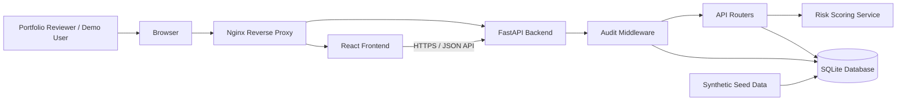
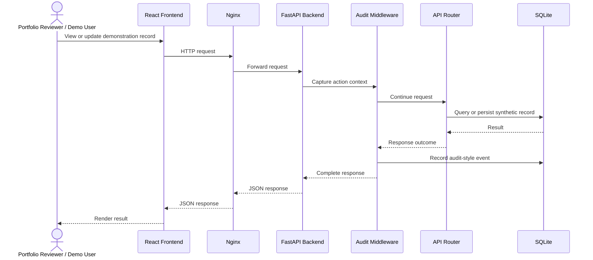
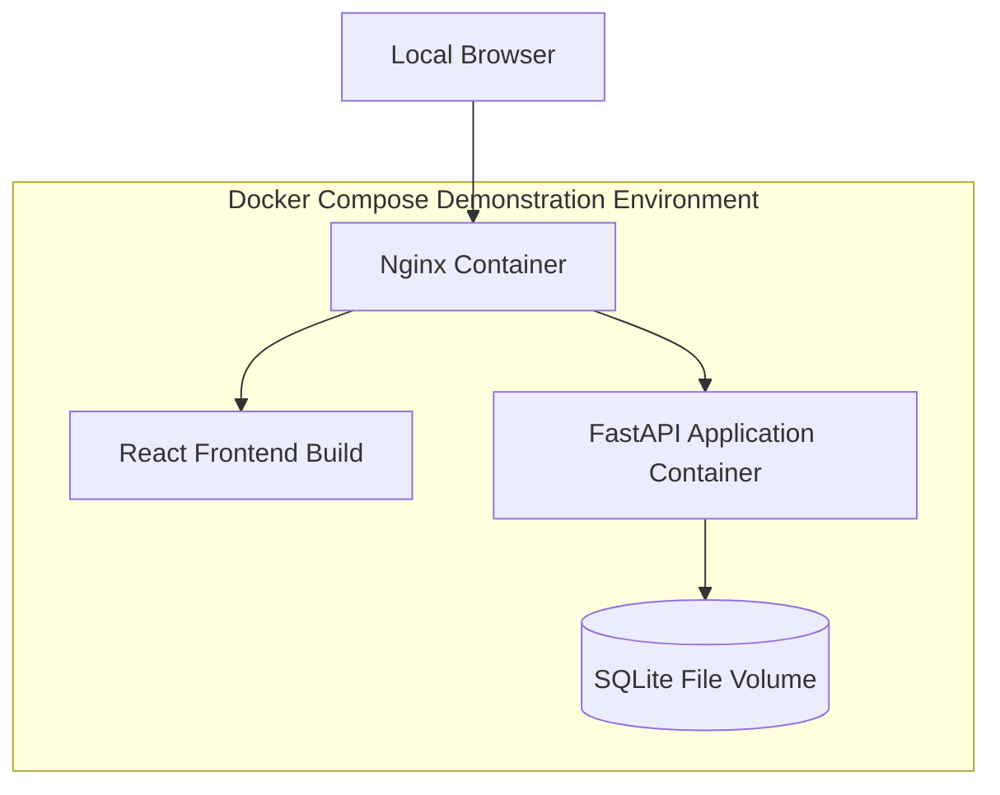

# CSV Evidence Tracker Architecture Diagram

> **Authorship:** This architecture diagram was designed and created by Alianis Reyes Reyes for the CSV Evidence Tracker portfolio project. It represents a portfolio-safe demonstration environment using synthetic data only.

## System Context

## Component Responsibilities

| Component | Responsibility |
|---|---|
| React frontend | Presents dashboard, traceability, test execution, deviation, and audit-trail demonstration views. |
| Nginx reverse proxy | Serves the frontend and routes API traffic to the backend in the containerized demonstration environment. |
| FastAPI backend | Exposes API endpoints and coordinates validation-workflow operations. |
| API routers | Group endpoint logic by functional area, including requirements, tests, deviations, evidence, and audit records. |
| Audit middleware | Records selected application actions as audit-trail-style events. |
| Risk scoring service | Calculates or derives risk-oriented metrics used in the demonstration workflow. |
| SQLite database | Stores synthetic CSV evidence-tracker records and audit events. |
| Synthetic seed data | Provides fictional demonstration records; no real regulated, patient, product, or proprietary data is permitted. |

## Data and Request Flow

## Deployment View

## Scope and Limitations

This diagram documents a demonstration architecture, not a production GxP architecture. It does not claim validated infrastructure, production-grade identity management, electronic signatures, backup and disaster recovery, formal change control, or compliance with 21 CFR Part 11. The system is intended only for local or portfolio demonstration with synthetic data.
