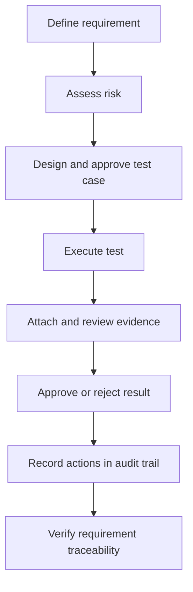
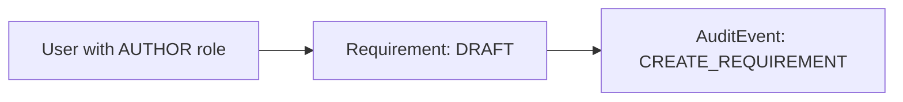
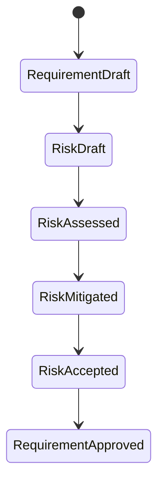
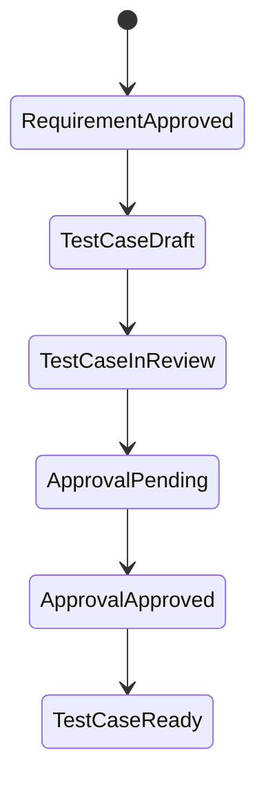
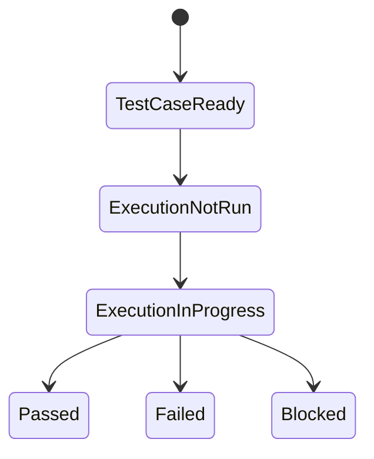
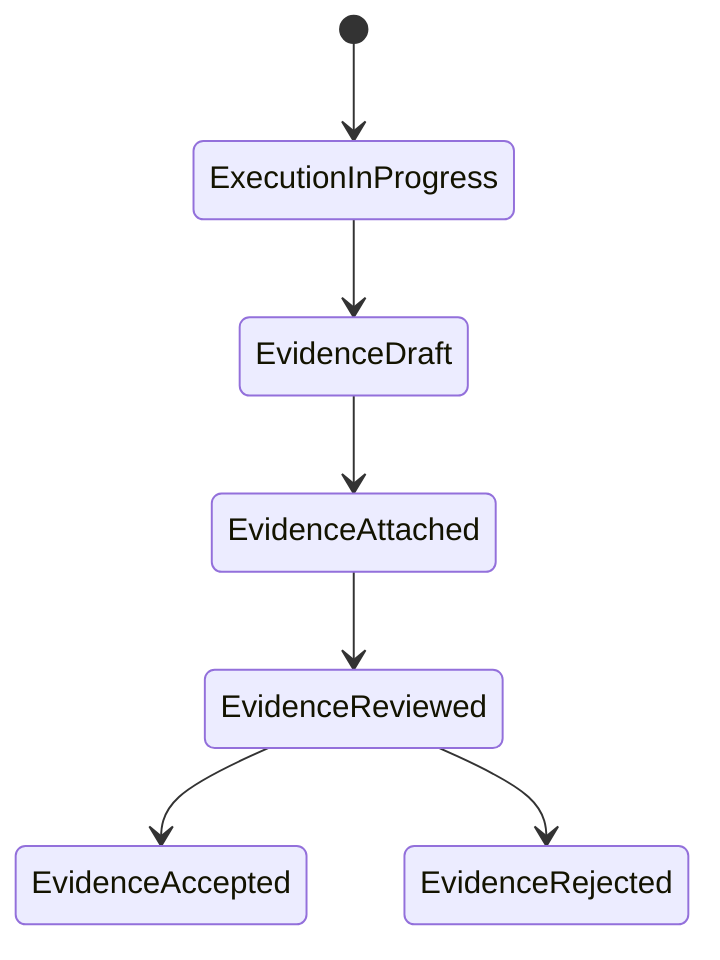
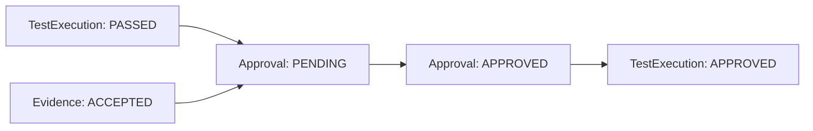
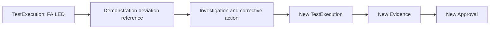
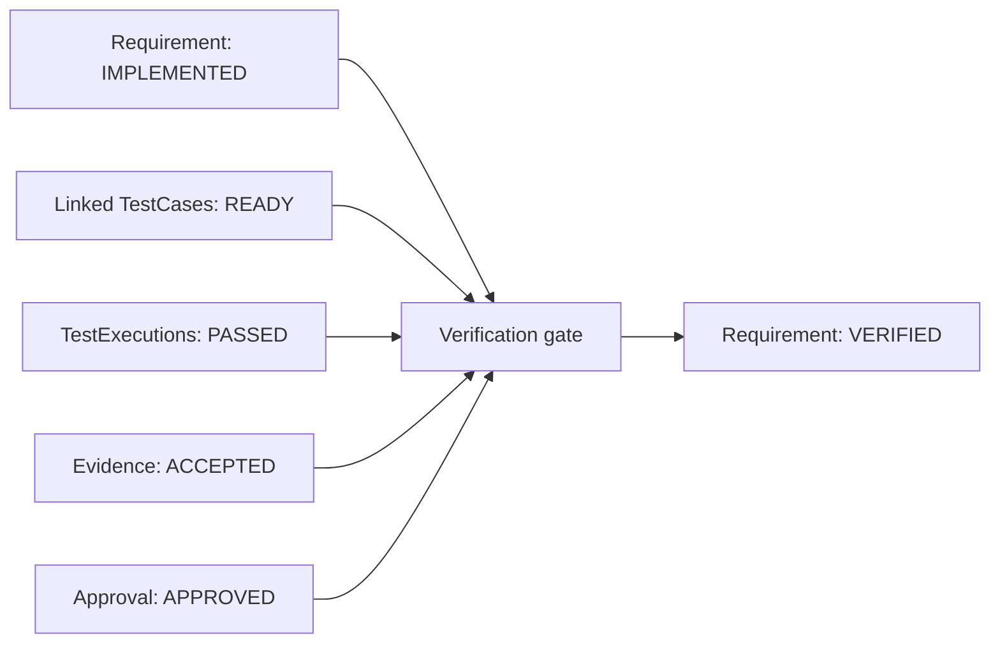

# CSV Evidence Tracker Entity Lifecycle Flow

> **Authorship:** This workflow was designed and created by Alianis Reyes Reyes for the CSV Evidence Tracker portfolio project. It is a portfolio-safe demonstration of Computer System Validation (CSV) practices using synthetic data only.

## Purpose

This document defines the proposed lifecycle for the core CSV Evidence Tracker entities: `User`, `Requirement`, `RiskAssessment`, `TestCase`, `TestExecution`, `Evidence`, `Approval`, and `AuditEvent`. The workflow demonstrates requirements traceability, risk-based validation thinking, test execution, evidence review, approvals, and audit-trail concepts.

## End-to-End Flow



## Entity Status Flows

| Entity | Status Flow |
|---|---|
| `Requirement` | `DRAFT` → `APPROVED` → `IMPLEMENTED` → `VERIFIED` → `RETIRED` |
| `RiskAssessment` | `DRAFT` → `ASSESSED` → `MITIGATED` → `ACCEPTED` |
| `TestCase` | `DRAFT` → `IN_REVIEW` → `APPROVED` → `READY` → `RETIRED` |
| `TestExecution` | `NOT_RUN` → `IN_PROGRESS` → `PASSED` / `FAILED` / `BLOCKED` |
| `Evidence` | `DRAFT` → `ATTACHED` → `REVIEWED` → `ACCEPTED` / `REJECTED` |
| `Approval` | `PENDING` → `APPROVED` / `REJECTED` |
| `AuditEvent` | Create-only; immutable after creation |

## Workflow Details

### 1. Create a Requirement

An `AUTHOR` creates a requirement with a unique identifier, description, category, and priority.



A requirement cannot move to `APPROVED` until it has an associated risk assessment.

### 2. Assess the Risk

A `REVIEWER` or QA user evaluates potential failure modes, impact, severity, probability, detectability, and risk mitigations.



High or critical residual risks must be mitigated or explicitly accepted before testing can proceed.

### 3. Design and Approve the Test Case

An `AUTHOR` creates an IQ, OQ, or PQ test case and links it to one or more requirements.



OQ and PQ test cases should have at least one linked requirement. Each traceability link records coverage type and rationale.

### 4. Execute the Test

A `TESTER` executes an approved version of the test case. The execution stores a controlled snapshot of the test-case version used.



The system logs the executor, timestamp, actual result, and justification for any failure or blocked result.

### 5. Attach Evidence

The tester attaches synthetic evidence, such as screenshots, API responses, sample logs, or generated reports.



A `PASSED` execution should have accepted evidence or a documented justification. Evidence records include a file reference, evidence type, upload details, and a SHA-256 integrity hash.

### 6. Approve the Test Result

An `APPROVER` reviews the execution and its evidence.



If the reviewer rejects the result, the original execution remains preserved. A new execution should be created for the retest rather than overwriting the historical record.

### 7. Handle Failed Testing



For the current scope, `deviation_reference` and `deviation_summary` can live on `TestExecution`. A dedicated `Deviation` entity can be added later for detailed investigation and CAPA-style workflows.

### 8. Verify the Requirement

A requirement becomes `VERIFIED` only when all required linked tests pass, have accepted evidence, and receive the appropriate approval.



If a critical test fails or evidence is missing, the requirement remains `IMPLEMENTED` or can be flagged as `AT_RISK`.

## Audit Trail Example

Every meaningful action generates an immutable `AuditEvent`:

```json
{
  "event_type": "STATUS_CHANGE",
  "entity_type": "TEST_EXECUTION",
  "entity_id": "TE-2026-001",
  "actor_id": "user-tester-001",
  "before_state": {
    "status": "IN_PROGRESS"
  },
  "after_state": {
    "status": "PASSED"
  },
  "reason": "Expected result observed; synthetic API response attached.",
  "event_timestamp": "2026-08-19T05:28:00Z"
}
```

## Scope Statement

This document describes a demonstration workflow only. The project does not claim production validation, regulatory compliance, inspection readiness, or compliance with 21 CFR Part 11. No real patient, product, manufacturing, study, employee, or proprietary data should be used in the application.
